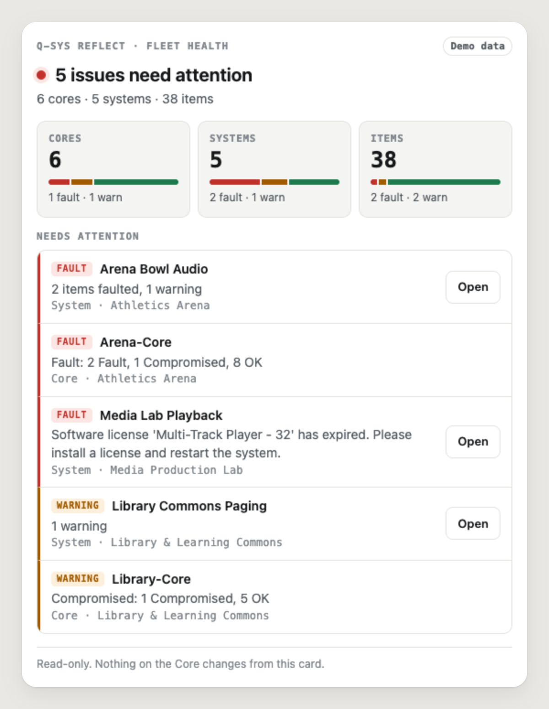
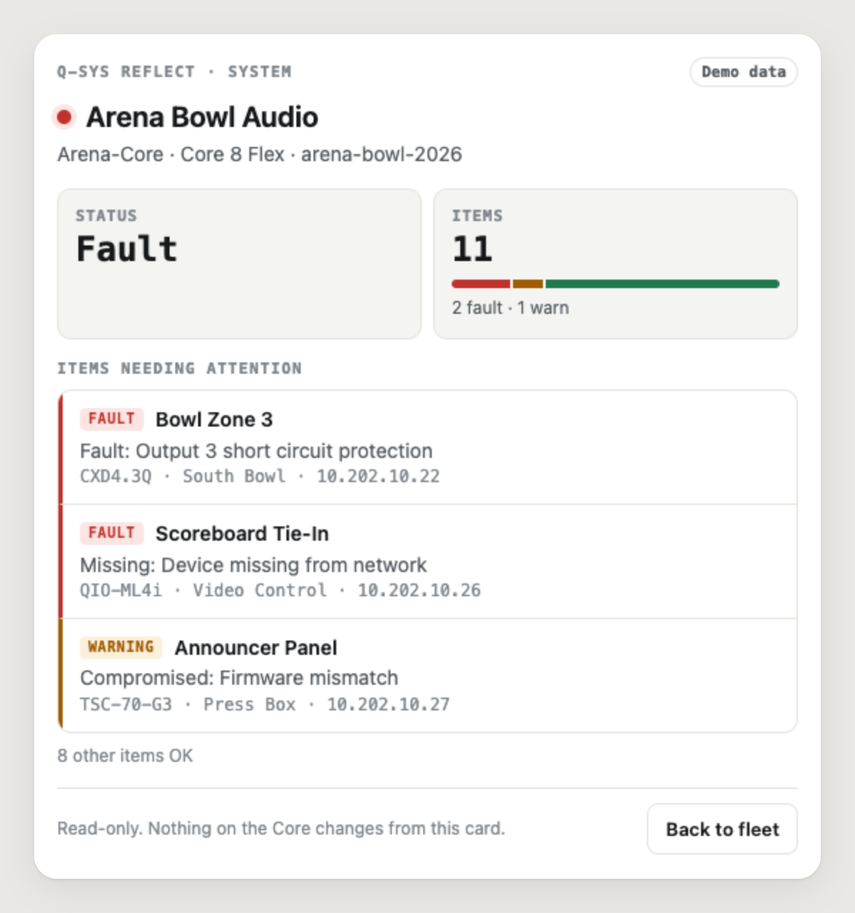

# qsys-reflect-mcp

An [MCP](https://modelcontextprotocol.io) server for **Q-SYS Reflect Enterprise Manager**, QSC's cloud monitoring service for Q-SYS Cores. Ask Claude, ChatGPT, or any MCP client "is anything down across our campus?" and get an answer built from Reflect's public API. Hosts that support [MCP Apps](https://github.com/modelcontextprotocol/ext-apps) also show an inline status card.

- **Read-only by design.** All 12 tools are annotated `readOnlyHint: true`. Nothing changes on a Core or System.
- **Fleet health rollup.** Reflect's public API has no alarms endpoint, so `get_fleet_health` works out health from core, system, and item status and ranks issues worst first.
- **Runs without a key.** `--demo` serves a fictional campus that matches the published schema, so you can try it, test it, and demo it before you have Reflect credentials.
- **One server factory** serves stdio (Claude Desktop, Claude Code, Cursor) and stateless Streamable HTTP (remote connectors, serverless).

<p>
  
  
</p>

<sub>The MCP Apps card on demo data, captured from <code>npm run preview</code> (<code>npm run screenshots</code> regenerates these). A <a href="docs/card-fleet-dark.png">dark theme</a> follows the host.</sub>

## Try it in 30 seconds (no key)

```bash
git clone https://github.com/Pgarciapg/qsys-reflect-mcp && cd qsys-reflect-mcp
npm install && npm run build
node dist/cli.js --demo --http   # MCP at http://localhost:3333/mcp
```

To see the card the way a host renders it:

```bash
npm run preview                  # http://127.0.0.1:4747
```

## Connect it to a client

**Claude Code**

```bash
claude mcp add qsys-reflect -- node /path/to/qsys-reflect-mcp/dist/cli.js --demo
```

**Claude Desktop** (`claude_desktop_config.json`)

```json
{
  "mcpServers": {
    "qsys-reflect": {
      "command": "node",
      "args": ["/path/to/qsys-reflect-mcp/dist/cli.js"],
      "env": { "QSYS_REFLECT_API_TOKEN": "your-reflect-token" }
    }
  }
}
```

Leave out the token, or pass `--demo`, to use demo data.

**Remote (Streamable HTTP)**

```bash
QSYS_REFLECT_API_TOKEN=... node dist/cli.js --http --port 3333
```

The endpoint is stateless: every POST to `/mcp` gets a fresh server, so it scales horizontally and runs as a serverless function (`createHttpHandler` is exported for that). `GET /healthz` reports mode and version.

It binds to `127.0.0.1` and rejects any other `Host` header, which blocks DNS rebinding. To serve beyond localhost, set a bearer secret; the server refuses to bind without one:

```bash
MCP_HTTP_TOKEN=$(openssl rand -hex 32) MCP_ALLOWED_HOSTS=mcp.example.com \
  QSYS_REFLECT_API_TOKEN=... node dist/cli.js --http --host 0.0.0.0
```

## Getting a Reflect token

In Reflect, go to **Organization → API Tokens** and create a token. It is a 64-character hex string, sent as `Authorization: Bearer <token>`. Provide it with any of:

| Variable | Use |
|---|---|
| `QSYS_REFLECT_API_TOKEN` | The token itself |
| `QSYS_REFLECT_API_TOKEN_FILE` | Path to a file holding either the bare token or a `QSYS_REFLECT_API_TOKEN=...` line (`#` comments skipped) |
| `QSYS_REFLECT_BASE_URL` | Override the API base (default `https://reflect.qsc.com/api/public/v0`) |
| `MCP_HTTP_TOKEN` | Bearer secret HTTP callers must send; required off localhost |
| `MCP_ALLOWED_HOSTS` | Comma-separated `Host` names to accept off localhost |

## Tools

| Tool | Reflect endpoint(s) | What it answers |
|---|---|---|
| `get_fleet_health` (card) | `GET /cores`, `GET /systems` | What needs attention right now, worst first |
| `get_system` (card) | `GET /systems/{id}`, `GET /systems/{id}/items` | One system's status and inventory, worst first |
| `list_cores` | `GET /cores` | Cores with model, firmware, site, redundancy, health; filter by level |
| `get_core` | `GET /cores/{id}` | Full core record and when it came up |
| `list_systems` | `GET /systems` | Systems with platform, health, item tallies; filter by level |
| `list_system_items` | `GET /systems/{id}/items` | Inventory, filter by level or type (e.g. `amplifier`) |
| `get_system_item` | `GET /systems/{id}/items/{itemId}` | Network interfaces, DNS, NTP, 802.1X, pairing |
| `get_core_events` | `GET /cores/{id}/events` | Paginated event log with date range and severity filter |
| `browse_core_media` | `GET /cores/{id}/media/{path}` | Media drive listing (metadata only) |
| `list_media_playlists` | `GET /cores/{id}/media_playlists` | Playlists and track counts |
| `list_softphones` | `GET /systems/{id}/telephony/softphones` | SIP softphone settings, proxy passwords redacted |
| `get_audit_events` | `GET /users/audit-events` | Sign-in audit trail |

Every result puts a one-sentence `summary` first in `structuredContent`, then the data. Some hosts pass only `structuredContent` to the model, so the summary is what the model sees first. Errors come back as `isError` results with a plain reason (bad token, no access, not found) instead of a stack trace.

### The status card

`get_fleet_health` and `get_system` declare the `ui://qsys-reflect/status-v1.html` resource (`text/html;profile=mcp-app`). The card is a single self-contained HTML file with no network access. It picks up the host's theme tokens, adapts to width, and uses the host bridge to drill from a faulted system on the fleet view into that system's inventory. Hosts without MCP Apps support get the same data as text. `--no-card` turns the card off.

## What is verified and what is assumed

This server was built from QSC's published OpenAPI spec, [`qrem-public-api.yaml`](https://reflect.qsc.com/static/qrem-public-api.yaml) (v0.1.1), without access to a live Reflect organization.

**Verified against the spec:** the base URL, Bearer auth, all 14 operations and their paths, every schema field and its nullability, the `events`/`total` and `items`/`total` pagination envelopes, and the `page`/`pageSize`/`dates` parameters. `npm run spec:check` re-fetches the spec and fails if QSC adds, removes, or changes an operation. CI runs it as a drift check.

**Assumptions, marked in code:**
- Status codes other than `0` (OK) follow the Q-SYS Designer convention: 1 Compromised, 5 Initializing → warning; 2 Fault, 3 Not Present, 4 Missing → fault. The spec documents only `0`.
- `Core.uptime` is treated as an epoch-milliseconds timestamp, based on the spec's example value.
- Reflect documents no rate limits and no page-size maximum. This server caps `pageSize` at 500 and times requests out after 15 s.
- Browsing the media root requests `/cores/{id}/media/` with an empty path. The spec marks `mediaPath` as required, so how Reflect answers that is unconfirmed.

**Safety rails:** media paths with `.`/`..` segments (plain or percent-encoded) are refused before any request, so a crafted path cannot reach another endpoint with your token. Softphone proxy passwords are replaced with `[redacted]`. Upstream error bodies reach the model only as Reflect's JSON `message`, never as raw HTML or stack traces. The token is never included in errors or logs.

**Deliberately left out:** `GET /systems/{id}/events` (deprecated upstream) and `PUT /systems/{id}/telephony/softphones`, the API's only write. A write tool would ship separately, with `destructiveHint: true`, off by default.

## Use it as a library

```ts
import { createServer, HttpReflectClient, CARD_HTML } from "qsys-reflect-mcp";

const server = createServer({
  client: new HttpReflectClient({ token: process.env.QSYS_REFLECT_API_TOKEN! }),
  source: "live",
  cardHtml: CARD_HTML,
});
```

`HttpReflectClient` and `DemoReflectClient` both implement `ReflectReader`, so you can plug in your own (a caching layer, a recorded fixture) without touching the tools.

## Development

```bash
npm install
npm test             # builds, then runs node:test (Node 22.18+; tests run as TypeScript via type stripping)
npm run typecheck
npm run preview      # local MCP Apps host for the card
npm run spec:check   # compare against QSC's live spec
```

```
src/reflect/   typed client, spec types, demo data
src/health.ts  status → level mapping and fleet rollup
src/tools.ts   tool definitions, annotations, result shaping
src/server.ts  the one server factory
src/http.ts    stateless Streamable HTTP handler
view/          the MCP Apps card (bundled into src/generated at build)
preview/       a minimal local MCP Apps host
```

## Not affiliated with QSC

Q-SYS and Q-SYS Reflect are trademarks of QSC, LLC. This is an independent project that uses Reflect's public API. The demo organization and every name, ID, and address in it are fictional.

## License

MIT
